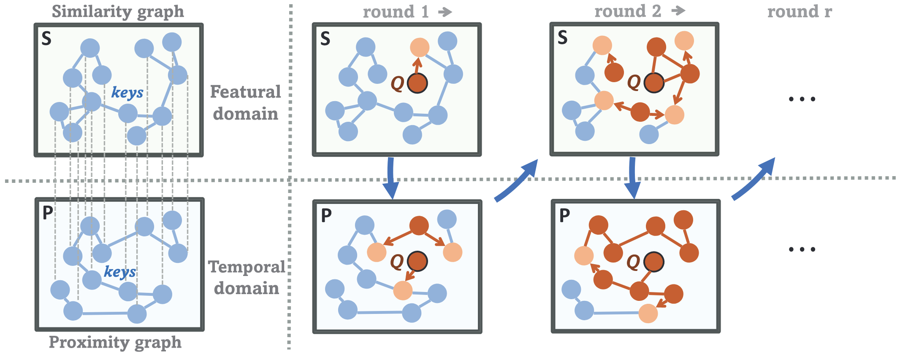

# ASAP-Attention (TNNLS 2024)

### This is an offical implementation of paper: [Learning Temporal Features With Alternated  Similarity and Proximity Attention for  Time-Series Prediction](https://arxiv.org/abs/2211.14730). 


## Environment

The main packages' version we used are:
```
python=3.6.15
numpy=1.19.4
torch=1.8.0
cudatoolkit=11.1.1
```


## Usage

You can train ASAP model by these commands.
```
cd ./ASAP
cp ./scripts/ASAP/ETTh1_ASAP.sh

bash ETTh1_ASAP.sh
```


## Acknowledgement

We appreciate the following github repo very much for the valuable code base and datasets:

https://github.com/yuqinie98/PatchTST

https://github.com/thuml/iTransformer


## Citation

If you find this repo useful in your research, please consider citing our paper as follows:

```
@article{chen2025learning,
  title={Learning Temporal Features With Alternated Similarity and Proximity Attention for Time-Series Prediction},
  author={Chen, Jingyang and Li, Ping and Lv, Jiancheng and Zha, Hongyuan and Zhang, Kai and Zhang, Jie},
  journal={IEEE Transactions on Neural Networks and Learning Systems},
  year={2025},
  publisher={IEEE}
}
```

